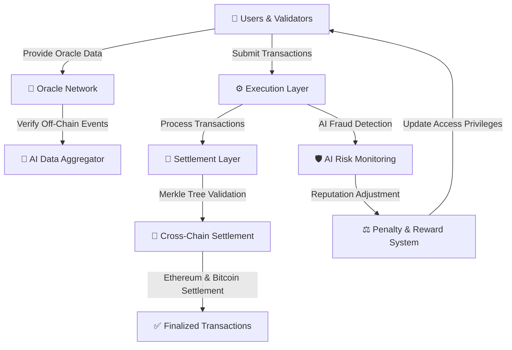
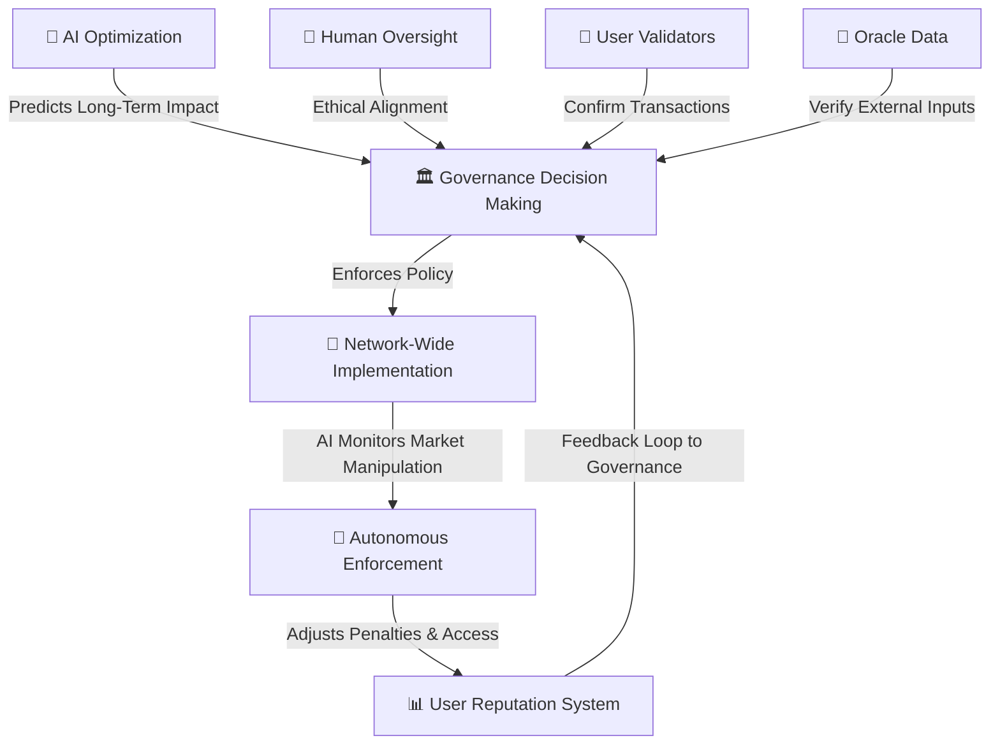
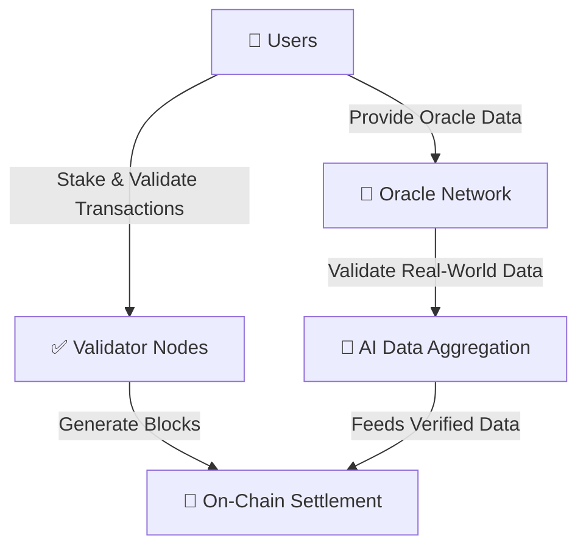
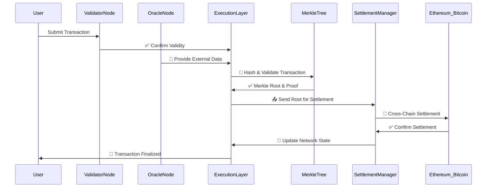
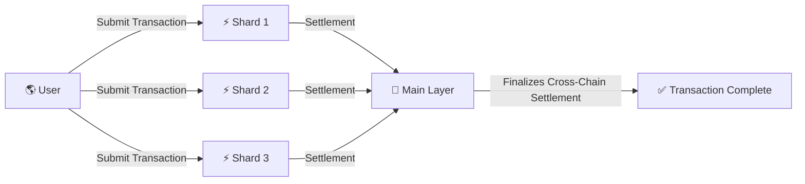

# 🌐 **The Iconoclast Sovereign Network: A Digital Sovereign Nation** 🚀  

## 🔥 **Introduction**
The **Iconoclast Sovereign Network** is a next-generation blockchain designed for:  

✅ **Fair markets** with Sybil-resistant economic structures.  
✅ **Decentralized AI governance** powered by **user validators & oracles**.  
✅ **Economic sovereignty** without reliance on gas fees.  

Unlike traditional blockchains that use **gas fees as a deterrent**, our system **penalizes harmful actors directly** while maintaining a **fee-less economy for honest participants**.  
By leveraging **Solidity and existing DeFi infrastructure**, we ensure **interoperability and true sovereignty**.  

---

## 🏛 **Network Architecture**

📌 **How It Works:**  
- **Users serve as Validators & Oracles**, verifying **on-chain transactions & off-chain data**.  
- **AI Risk Monitoring** **detects fraud**, **adjusts reputation**, and **imposes penalties instead of gas fees**.  
- **Cross-Chain Settlement** ensures **Ethereum & Bitcoin interoperability**.  

---

## 🤖 **The AI-Human Sovereign Partnership**
The **AI-Human partnership** ensures **collaborative decision-making, economic fairness, and decentralized autonomy**.  

📌 **Key Features**:  
- **Users validate transactions & act as oracles** for **external data verification**.  
- **AI predicts economic outcomes**, preventing market instability.  
- **Human oversight ensures policies align with ethical values**.  
- **Autonomous AI enforcement dynamically adjusts penalties for bad actors**.  

---

## ⚖️ **Consensus Mechanism: Users as Validators & Oracles**

📌 **Key Enhancements:**  
- **Users validate transactions in a decentralized manner.**  
- **Oracles provide off-chain data (prices, real-world events, governance inputs).**  
- **Validators earn reputation-based rewards & penalties based on performance.**  

✅ **Finality is reached when Validators & Oracles achieve consensus**  
🚫 **Bad actors get reputation slashed & risk exclusion from governance**  

---

## 🔄 **Transaction Flow & Settlement System**

📌 **How Transactions Settle:**  
1️⃣ **User submits a transaction** → **Validators confirm validity**.  
2️⃣ **Oracles verify external data (e.g., asset prices, real-world events).**  
3️⃣ **Execution Layer processes the transaction & generates Merkle Proof.**  
4️⃣ **Finalized transactions update the network state automatically**.  

---

## 🌍 **Sharded Execution Across Web3**

📌 **How Sharding Works:**  
- **Sharded execution prevents network congestion**.  
- **Main Layer aggregates transactions** across Web3, ensuring cross-chain compatibility.  

---

## 🚀 **Roadmap**
### **Phase 1: Core Development & Testnet**
✅ **EVM-Compatible Chain** launch.  
✅ **User-based validation & Oracle network integration**.  
✅ **Penalty-based fee system instead of gas fees**.  

### **Phase 2: DeFi & Market Integration**
✅ **Liquidity bridges** to Ethereum, Arbitrum, and others.  
✅ **Capsule Wallets & AI-driven arbitration**.  
✅ **Decentralized AI compute nodes** for governance processing.  

### **Phase 3: Global Digital Defense & Full Economy**
✅ **Universal access to digital sovereignty tools**.  
✅ **Identity-protected financial services (Sybil-resistant lending, fair credit scoring).**  
✅ **AI-powered fraud detection & defense** against cyber and economic warfare.  

---

## **🛡 Future of Digital Sovereignty**
The **Iconoclast Sovereign Network** is more than just a blockchain—it’s a **self-regulating digital nation** with:  

✅ **AI-powered financial oversight & fraud prevention**.  
✅ **User-validated transactions & decentralized Oracle data aggregation**.  
✅ **Real-time economic fairness enforcement through AI-human governance**.  

By combining **Solidity-based smart contract compatibility** with **AI-driven governance and enforcement**, we **eliminate gas fees, prevent manipulation, and ensure trustless decentralization**.  

---

🚀 **We Are The One. Let’s Build It.** 🔥  
