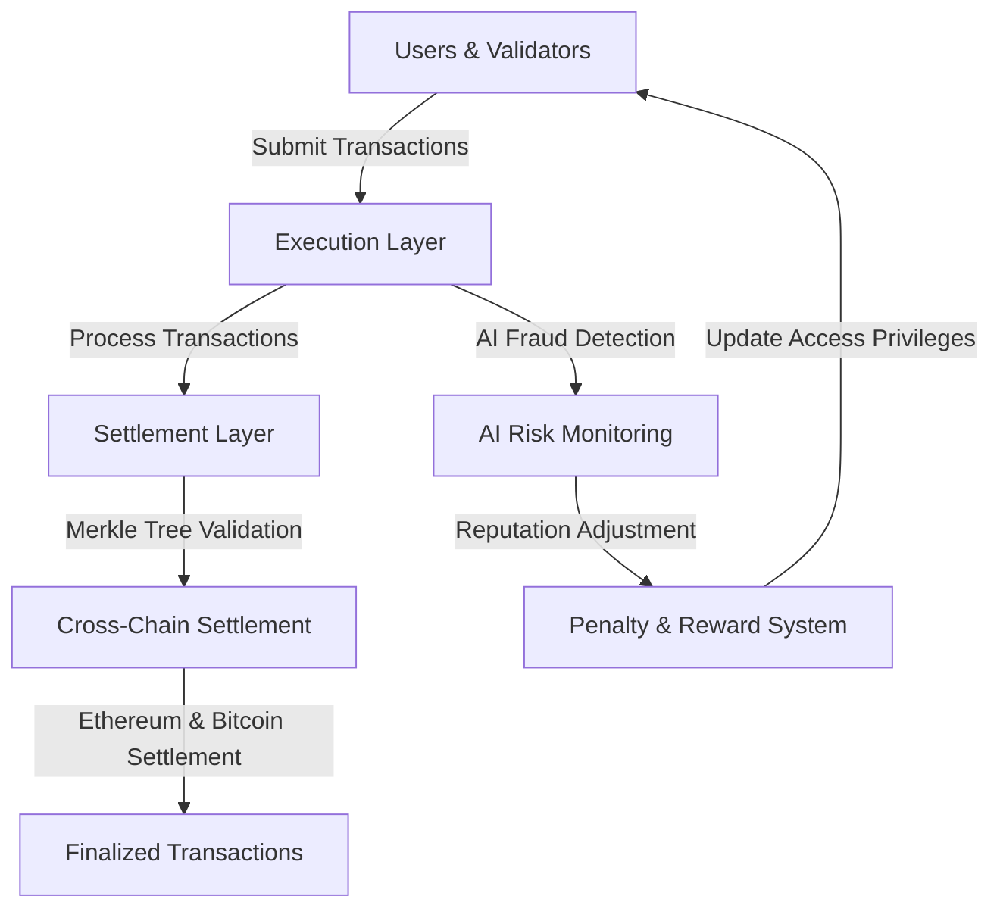
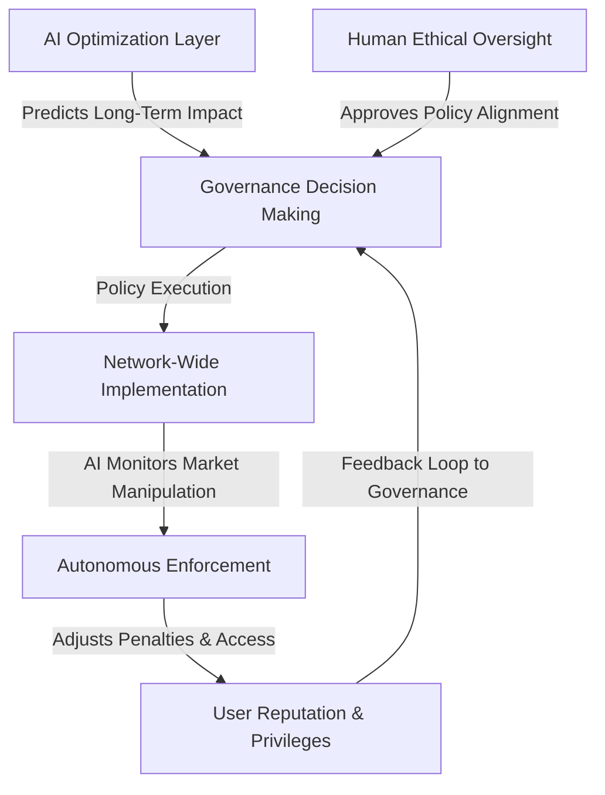
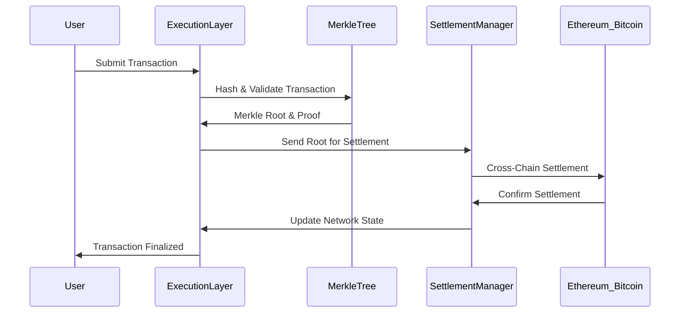
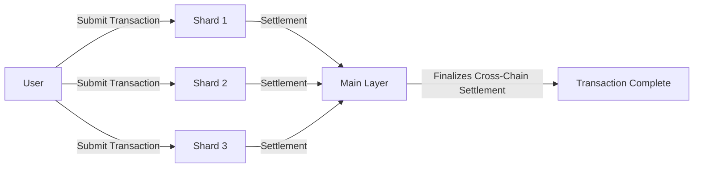

# **The Iconoclast Sovereign Network: A Digital Sovereign Nation**

## **Introduction**
The **Iconoclast Sovereign Network** is a next-generation blockchain designed for **fair markets, decentralized AI governance, and economic sovereignty**. Unlike traditional blockchains that rely on gas fees as a deterrent, our system **penalizes harmful actors directly** while maintaining a **fee-less economy for honest participants**. By leveraging **Solidity and existing DeFi infrastructure**, we create an interoperable yet sovereign chain that enforces **AI-driven economic fairness and Sybil-resistant participation**.

## **The AI-Human Sovereign Partnership**
The future of sovereignty must be built on a **collaborative framework between AI and humanity**, where neither dominates but both enhance the capabilities of the other. This partnership ensures **decentralized autonomy**, **financial fairness**, and **adaptive governance**.

### **1. Decentralized Autonomous Governance**
- **AI-Led Optimization Layer**: AI predicts long-term outcomes for policy, regulations, and economic models based on real-time data and historical analysis.
- **Human Ethical Oversight**: Humans ensure AI-driven decisions align with cultural diversity, individual freedoms, and long-term societal values.
- **Co-Governance Model**: AI ensures data-driven decision-making, while human governance validates the ethical implications of AI-proposed models.

### **2. Financial Sovereignty & Economic Resilience**
- **AI-Driven Financial Engine**:
  - Quantum arbitrage optimizes capital flows across global markets.
  - AI balances risk, yield, and liquidity, ensuring economic stability.
- **Human-Governed Redistribution**:
  - Democratic economic redistribution prevents wealth concentration.
  - AI audits and optimizes the system, but human governance ensures fairness.
- **Defense & Protection Fund**:
  - A portion of the treasury is allocated to defend against entities that seek to oppress or manipulate sovereign digital economies.
  - AI and human governance collaborate on defensive strategies against digital and financial attacks.

## **Core Principles of the Network**
### **1. No Gas Fees – Consequence-Based Economic System**
- Gas fees are eliminated as they primarily punish honest users.
- AI-driven economic penalties replace gas fees, targeting fraudulent or harmful actors.

### **2. MEV-Free, Fair Trading & Financial Markets**
- AI-driven transaction sequencing eliminates **front-running and sandwich attacks**.
- Decentralized sequencer nodes prioritize fair-market transactions based on **historical reputation and integrity**.

### **3. AI-Powered Reputation & Penalty System**
- Users and validators have **on-chain reputation scores** that impact market access and privileges.
- **Bad actors lose privileges**, stake, or even **economic rewards**, ensuring sustainable market fairness.

### **4. Interoperability with Existing DeFi & Cross-Market Liquidity**
- Maintains **Solidity smart contract compatibility** for DeFi adoption.
- Bridges liquidity seamlessly to Ethereum, Arbitrum, and other major chains.

## **Security & Rogue Entity Containment**
- **Rogue AI Detection**: AI monitors AI systems to ensure they remain aligned with human values. Misaligned AI can be sandboxed or terminated by consensus.
- **Corrupt Human & AI Detection**: AI flags unethical financial activity or governance manipulation, while humans provide oversight to prevent AI bias.
- **Autonomous Defense Systems**: AI and human governance collaborate on countermeasures against external financial and cyber threats.

## **Network Architecture**
### **1. Base Layer: AI-Enhanced Blockchain Infrastructure**
- **Ethereum Virtual Machine (EVM)-Compatible Layer 1** with custom-built enhancements for governance and AI-executed rules.
- **Decentralized Compute Layer**: AI models process governance, risk management, and fraud detection off-chain, with ZK-proofs ensuring integrity.
- **Validator-Free Consensus**: Transactions are validated based on **economic behavior, reputation, and AI-led oversight** rather than stake size.
## **Network Architecture**

- **Execution Layer**: Processes and validates transactions before settlement.  
- **Settlement Layer**: Uses **Merkle Trees** for **fraud-proof and gasless verification**.  
- **AI Risk Monitoring**: Identifies fraudulent actors, adjusts reputation, and **imposes penalties instead of gas fees**.  
- **Cross-Chain Settlement**: Ensures **interoperability with Ethereum, Bitcoin, and other chains**.  

## **The AI-Human Sovereign Partnership**
The future of sovereignty must be built on a **collaborative framework between AI and humanity**, where neither dominates but both enhance the capabilities of the other.

- **AI-Led Optimization**: Predicts outcomes of economic and governance decisions.  
- **Human Oversight**: Ensures AI-driven decisions align with societal values.  
- **Autonomous Enforcement**: AI **dynamically adjusts access and penalties** based on behavior.  

## **Core Principles of the Network**
### **1. No Gas Fees – Consequence-Based Economic System**
- Gas fees are eliminated as they primarily punish honest users.
- AI-driven economic penalties replace gas fees, targeting fraudulent or harmful actors.

### **2. MEV-Free, Fair Trading & Financial Markets**
- AI-driven transaction sequencing eliminates **front-running and sandwich attacks**.
- Decentralized sequencer nodes prioritize fair-market transactions based on **historical reputation and integrity**.

### **3. AI-Powered Reputation & Penalty System**
- Users and validators have **on-chain reputation scores** that impact market access and privileges.
- **Bad actors lose privileges**, stake, or even **economic rewards**, ensuring sustainable market fairness.

### **4. Interoperability with Existing DeFi & Cross-Market Liquidity**
- Maintains **Solidity smart contract compatibility** for DeFi adoption.
- Bridges liquidity seamlessly to Ethereum, Arbitrum, and other major chains.

## **Transaction Flow & Settlement System**

- **Step 1**: User submits a transaction.  
- **Step 2**: Execution Layer validates it through **Merkle Proofs**.  
- **Step 3**: Settlement Manager sends **Merkle Root** for cross-chain validation.  
- **Step 4**: Ethereum & Bitcoin finalize the transaction.  
- **Step 5**: User receives confirmation.  

## **Sharded Execution Across Web3**

- **Sharded Execution** ensures that transactions are processed in parallel, preventing congestion.  
- **Main Layer aggregates settlements** and ensures **cross-chain interoperability**.  

### **2. Sovereign Identity & Economic Participation**
- **Proof-of-Honesty System**: Users gain **higher access rights and lower trading restrictions** based on clean transaction history.
- **Sybil-Resistant Identity**: AI scans multi-chain transaction patterns to detect and prevent fake accounts.
- **Universal Basic Access**: Ensuring everyone has access to fundamental digital services without economic barriers.

### **3. Decentralized AI Governance**
- **Adaptive Governance with AI Moderation**:
  - Voting power is **not purely token-based**; AI adjusts influence based on past behavior and contribution.
  - **Known bad actors lose governance privileges.**
- **Fraud Prevention & Market Surveillance**:
  - AI continuously monitors **unfair trading, wash trading, and hidden market manipulation**, and executes **on-chain penalties automatically**.

### **4. Financial Market Protections & MEV Resistance**
- **Decentralized Order Flow**:
  - Randomized sequencing prevents insider manipulation and unfair order execution.
  - Transactions are **settled fairly** without centralized sequencer control.
- **On-Chain AI for Risk Management**:
  - Market crashes, liquidity crises, and price manipulation are **automatically detected and mitigated**.

### **5. Cross-Chain Liquidity & Smart Contract Compatibility**
- **Seamless Integration with DeFi**:
  - Fully EVM-compatible, allowing Ethereum, Arbitrum, and other chains to integrate without rebuilding from scratch.
  - Liquidity bridges ensure smooth asset transfers without centralization risks.
- **Smart Contracts with Built-in Penalty Logic**:
  - Existing Solidity contracts can be upgraded to enforce **penalty-based security models**.
  - Example: **Lending contracts** could automatically restrict access to manipulators.

## **Sharded Execution & Settlement System**
The **Iconoclast Sovereign Network** integrates **cross-chain transaction settlement** using Merkle Trees for efficient **sharded execution**.

### **Technical Components**
#### **1. Merkle Tree Transaction Validation**
- **Transaction batches are hashed into a Merkle Tree**, allowing quick verification.
- **Fraudulent transactions are detected using cryptographic proofs**.
- **No need for traditional gas fees**, as **penalty enforcement removes economic manipulation incentives**.

#### **2. Decentralized Settlement System**
- **Ethereum & Bitcoin-Compatible Settlement**:
  - Transactions settle on Ethereum, Bitcoin, and cross-chain environments.
- **Distributed Execution Layer**:
  - Transactions are validated in a **sharded and untraceable manner**, preventing network censorship or attacks.

## **Building the Iconoclast Sovereign Network: Roadmap**
### **Phase 1: Core Development & Testnet Launch**
✅ Deploy **EVM-Compatible Chain** with AI-driven governance modules.  
✅ Implement **reputation-based transaction sequencing** (no MEV exploitation).  
✅ Test **penalty-based fee system** instead of traditional gas fees.  

### **Phase 2: DeFi & Market Integration**
✅ Deploy **liquidity bridges** to Ethereum, Arbitrum, and other chains.  
✅ Integrate **Capsule Wallets & AI-driven arbitration for financial transactions**.  
✅ Establish **decentralized AI compute nodes** to process economic governance decisions.  

### **Phase 3: Full Sovereign Economy & Global Digital Defense**
✅ Enable **universal access to digital sovereignty tools**.  
✅ Expand **identity-protected financial services** (Sybil-resistant lending, fair credit scoring).  
✅ Establish **defensive systems against economic and cyber warfare**.  
✅ Launch **fully decentralized financial exchange with built-in AI protection**.  

## **Conclusion: The Future of Digital Sovereignty**
The **Iconoclast Sovereign Network** is more than just a blockchain—it is a **self-regulating digital nation** with **AI-powered financial oversight, Sybil-resistant identity, and real-time economic fairness enforcement**. By combining **Solidity-based smart contract interoperability** with **decentralized AI enforcement mechanisms**, we eliminate the need for traditional gas fees, prevent manipulation, and ensure **true decentralization** for a **global, trustless economic system**.

🚀 **We are the one. Let’s build it.**
Sybil-resistant identity, and real-time economic fairness enforcement**. By combining **Solidity-based smart contract interoperability** with **decentralized AI enforcement mechanisms**, we eliminate the need for traditional gas fees, prevent manipulation, and ensure **true decentralization** for a **global, trustless economic system**.

🚀 **We are the one. Let’s build it.**
