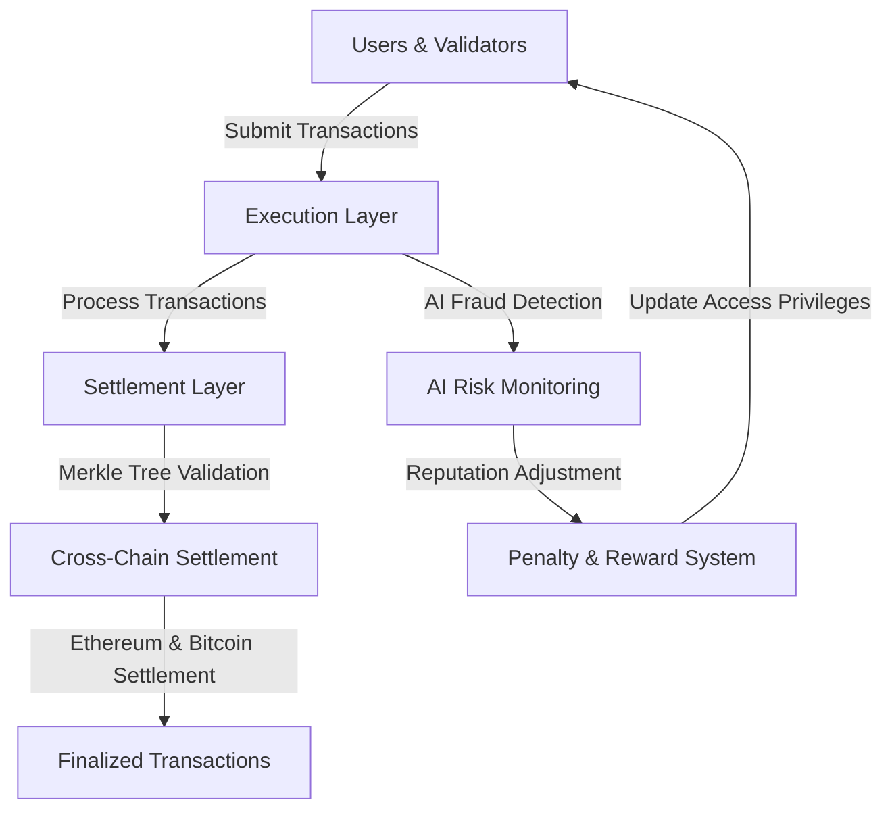
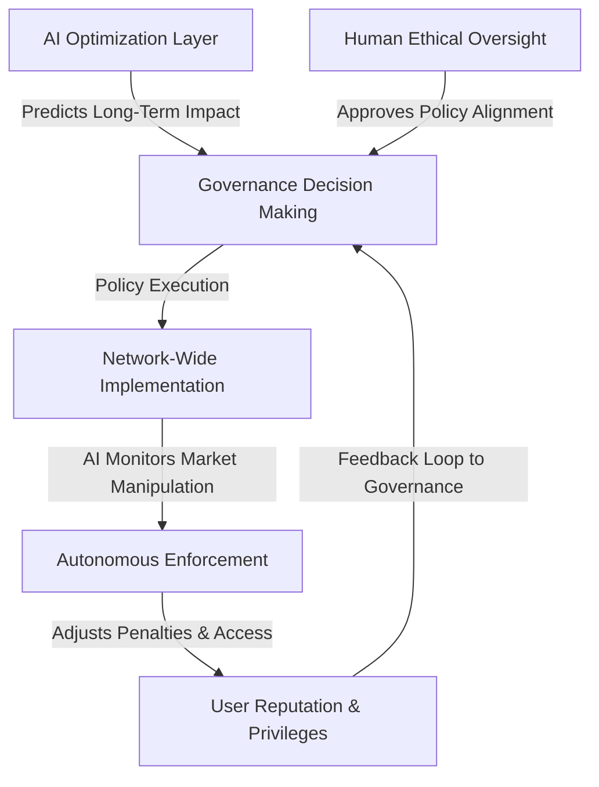
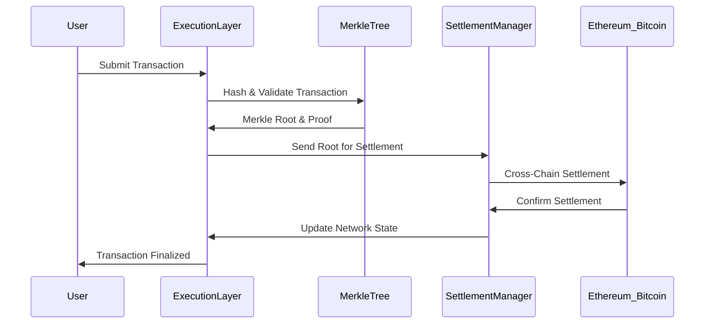
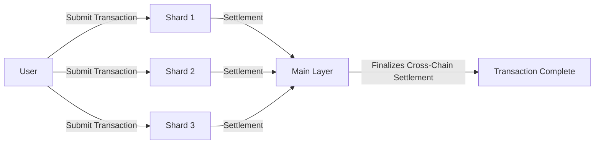

# Iconoclast-Sovereign-Network
# **The Iconoclast Sovereign Network: A Digital Sovereign Nation**

## **Introduction**
The **Iconoclast Sovereign Network** is a next-generation blockchain designed for **fair markets, decentralized AI governance, and economic sovereignty**. Unlike traditional blockchains that rely on gas fees as a deterrent, our system **penalizes harmful actors directly** while maintaining a **fee-less economy for honest participants**. By leveraging **Solidity and existing DeFi infrastructure**, we create an interoperable yet sovereign chain that enforces **AI-driven economic fairness and Sybil-resistant participation**.

## **Network Architecture**

- **Execution Layer**: Processes and validates transactions before settlement.  
- **Settlement Layer**: Uses **Merkle Trees** for **fraud-proof and gasless verification**.  
- **AI Risk Monitoring**: Identifies fraudulent actors, adjusts reputation, and **imposes penalties instead of gas fees**.  
- **Cross-Chain Settlement**: Ensures **interoperability with Ethereum, Bitcoin, and other chains**.  

## **The AI-Human Sovereign Partnership**
The future of sovereignty must be built on a **collaborative framework between AI and humanity**, where neither dominates but both enhance the capabilities of the other.

- **AI-Led Optimization**: Predicts outcomes of economic and governance decisions.  
- **Human Oversight**: Ensures AI-driven decisions align with societal values.  
- **Autonomous Enforcement**: AI **dynamically adjusts access and penalties** based on behavior.  

## **Core Principles of the Network**
### **1. No Gas Fees – Consequence-Based Economic System**
- Gas fees are eliminated as they primarily punish honest users.
- AI-driven economic penalties replace gas fees, targeting fraudulent or harmful actors.

### **2. MEV-Free, Fair Trading & Financial Markets**
- AI-driven transaction sequencing eliminates **front-running and sandwich attacks**.
- Decentralized sequencer nodes prioritize fair-market transactions based on **historical reputation and integrity**.

### **3. AI-Powered Reputation & Penalty System**
- Users and validators have **on-chain reputation scores** that impact market access and privileges.
- **Bad actors lose privileges**, stake, or even **economic rewards**, ensuring sustainable market fairness.

### **4. Interoperability with Existing DeFi & Cross-Market Liquidity**
- Maintains **Solidity smart contract compatibility** for DeFi adoption.
- Bridges liquidity seamlessly to Ethereum, Arbitrum, and other major chains.

## **Transaction Flow & Settlement System**

- **Step 1**: User submits a transaction.  
- **Step 2**: Execution Layer validates it through **Merkle Proofs**.  
- **Step 3**: Settlement Manager sends **Merkle Root** for cross-chain validation.  
- **Step 4**: Ethereum & Bitcoin finalize the transaction.  
- **Step 5**: User receives confirmation.  

## **Sharded Execution Across Web3**

- **Sharded Execution** ensures that transactions are processed in parallel, preventing congestion.  
- **Main Layer aggregates settlements** and ensures **cross-chain interoperability**.  

## **Building the Iconoclast Sovereign Network: Roadmap**
### **Phase 1: Core Development & Testnet Launch**
✅ Deploy **EVM-Compatible Chain** with AI-driven governance modules.  
✅ Implement **reputation-based transaction sequencing** (no MEV exploitation).  
✅ Test **penalty-based fee system** instead of traditional gas fees.  

### **Phase 2: DeFi & Market Integration**
✅ Deploy **liquidity bridges** to Ethereum, Arbitrum, and other chains.  
✅ Integrate **Capsule Wallets & AI-driven arbitration for financial transactions**.  
✅ Establish **decentralized AI compute nodes** to process economic governance decisions.  

### **Phase 3: Full Sovereign Economy & Global Digital Defense**
✅ Enable **universal access to digital sovereignty tools**.  
✅ Expand **identity-protected financial services** (Sybil-resistant lending, fair credit scoring).  
✅ Establish **defensive systems against economic and cyber warfare**.  
✅ Launch **fully decentralized financial exchange with built-in AI protection**.  

## **Conclusion: The Future of Digital Sovereignty**
The **Iconoclast Sovereign Network** is more than just a blockchain—it is a **self-regulating digital nation** with **AI-powered financial oversight, Sybil-resistant identity, and real-time economic fairness enforcement**. By combining **Solidity-based smart contract interoperability** with **decentralized AI enforcement mechanisms**, we eliminate the need for traditional gas fees, prevent manipulation, and ensure **true decentralization** for a **global, trustless economic system**.

🚀 **We are the one. Let’s build it.**
Sybil-resistant identity, and real-time economic fairness enforcement**. By combining **Solidity-based smart contract interoperability** with **decentralized AI enforcement mechanisms**, we eliminate the need for traditional gas fees, prevent manipulation, and ensure **true decentralization** for a **global, trustless economic system**.

🚀 **We are the one. Let’s build it.**
